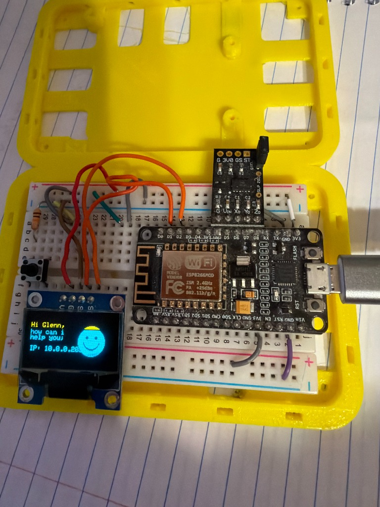

# ESP8266 OLED Wi-Fi Display Project

An interactive, connected IoT display project built using the ESP8266 development board and an I2C SSD1306 OLED display. The project connects to a local 2.4 GHz Wi-Fi network, performs an internet connectivity (ping) test to `google.com`, and displays status along with an expressive vector smiley face that transitions from **sad** to **happy** upon a successful connection.

Developed on **May 28, 2026**.

## Hardware Setup

Here is the physical wiring and assembly of the ESP8266 board and OLED display:



### Wiring Details

| OLED Display Pin | ESP8266 NodeMCU Pin | Description |
| :--- | :--- | :--- |
| **GND** | **GND** | Ground |
| **VCC** | **3V3** | 3.3V Power |
| **SDA** | **D2** (GPIO 4) | I2C Serial Data Line |
| **SCL** (or SCK) | **D1** (GPIO 5) | I2C Serial Clock Line |

*Note: The board is mounted inside a custom yellow 3D-printed enclosure.*

---

## Features

1. **Dynamic Boot Status:** Shows connection status to the `FOOTBALL_EXT_2.4G` Wi-Fi network with loading dots.
2. **Connectivity Test:** Attempts a TCP connection to `google.com:80` to verify full internet access.
3. **Face Expressions:**
   - **Sad Face:** Rendered during network setup and ping check to indicate offline status.
   - **Happy Face:** Rendered once the Google ping completes successfully to confirm full internet access.
4. **Local IP Address Display:** Displays the assigned IP on the screen for easy debugging and access.
5. **Serial Monitor Logging:** Outputs verbose diagnostic messages to the USB interface at `115200` baud.

---

## Software & Tools

This project was built and programmed using:
* **PlatformIO Core (6.1.19):** Used as the primary CLI compiler and project manager, providing a robust Arduino framework compile target for the ESP8266 (`espressif8266` platform and `nodemcuv2` board configuration).
* **Antigravity 2.0:** An advanced autonomous agentic AI pair-programming assistant that pair-programmed the firmware, diagnosed connection speeds, solved the 2.4GHz/5GHz hardware band mismatch, and automated compilation, flashing, and verification.
* **Libraries:**
  - `Adafruit GFX Library` (v1.12.6) for pixel rendering and geometry.
  - `Adafruit SSD1306` (v2.5.16) for screen buffers.
  - Built-in `ESP8266WiFi` for network stack management.

---

## Step-by-Step Setup and Installation

### 1. Prerequisites and Installation

To set up and compile this project, you need the **PlatformIO CLI** or **VS Code with the PlatformIO IDE extension**.

*   **PlatformIO CLI (Core):**
    Install via Homebrew (macOS) or Python pip:
    ```bash
    # Via Homebrew (macOS)
    brew install platformio

    # Via Python pip
    pip install -U platformio
    ```
*   **USB Drivers:**
    Depending on your specific NodeMCU board, you may need to install the USB-to-UART bridge drivers for your OS:
    *   [CP210x USB to UART Bridge Drivers](https://www.silabs.com/developers/usb-to-uart-bridge-vcp-drivers)
    *   [CH340/CH341 USB to Serial Drivers](http://www.wch-ic.com/downloads/CH341SER_ZIP.html) (common on budget ESP8266 boards)

### 2. Getting the Code

Clone the repository to your local machine:
```bash
git clone https://github.com/gmossy/arduino-ai-experiments.git
cd arduino-ai-experiments
```

### 3. Configuring Wi-Fi Credentials

Open `src/blink.ino` in your editor and locate the Wi-Fi credentials section (around lines 14-15):
```cpp
const char* ssid = "YOUR_2.4GHZ_SSID";
const char* password = "YOUR_WIFI_PASSWORD";
```
> [!WARNING]
> Ensure you connect to a **2.4 GHz Wi-Fi network**. The ESP8266 does not support 5 GHz networks.

### 4. Detecting the USB Port

Connect your ESP8266 to your computer using a micro-USB cable that supports data transfer.
*   **On macOS/Linux:** Find the device path by listing active serial devices:
    ```bash
    ls /dev/cu.usbserial-*
    # Example: /dev/cu.usbserial-0001
    ```
*   **On Windows:** Check Device Manager under "Ports (COM & LPT)" to identify the COM port (e.g., `COM3`).

If your port path differs from `/dev/cu.usbserial-0001`, open `platformio.ini` and update the `upload_port` and `monitor_port` values:
```ini
upload_port = YOUR_DETECTED_PORT
monitor_port = YOUR_DETECTED_PORT
```

---

## Building and Uploading

Once configured, run the following PlatformIO commands in your terminal inside the project directory:

### 1. Compile the Project
Builds the binaries and automatically downloads all external library dependencies (`Adafruit GFX`, `Adafruit SSD1306`, and `BusIO`):
```bash
pio run
```

### 2. Upload the Firmware
Flashes the compiled program to the ESP8266 flash memory via the configured USB port:
```bash
pio run --target upload
```

### 3. Monitor Serial Output
Launch the serial console monitor to read diagnostic messages (such as Wi-Fi connection steps and the Google ping check status) at `115200` baud:
```bash
pio device monitor
```
